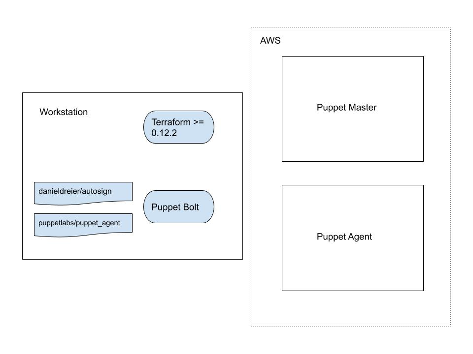

# Terraform Puppet Provisioner Test

## Overview

This is a proof of concept of the Puppet Terraform provisioner that was added in Terraform 0.12.2. It uses Terraform and the Terraform Puppet provisioner to set up a Puppet Master and Agent that both use the latest Amazon Linux 2 AMI, it installs a very simple "hello world" Puppet module on the Puppet Master, and then configures the agent node using this code.

It assumes you will use Mac OS X on your laptop. Minor changes would be required otherwise.

## Architecture

The following figure shows the main components of the solution:



## Dependencies

Install the latest Terraform (>= 0.12.2). Get that from [here](https://www.terraform.io/downloads.html).

Puppet Bolt is also required, but the setup.sh script will install it if it's not there.

Note also that, at the time of writing, the project depends on an [unmerged](https://github.com/puppetlabs/puppetlabs-puppet_agent/pull/444) pull request I've raised against the [puppetlabs-puppet_agent](https://github.com/puppetlabs/puppetlabs-puppet_agent) project to add Amazon Linux 2 support. This is branch is referenced in the [Puppetfile](./bolt/Puppetfile) so again no need to do anything yet.

There is also an assumption that you will provide an EC2 key pair and it will have the name "default". If that's not there, create the EC2 Key Pair using:

```text
▶ aws ec2 create-key-pair --key-name default
```

## Usage

### Setup script

First run the setup script.

```text
▶ bash -x setup.sh
```

This will:

- If necessary, install the latest Puppet Bolt as a Brew Cask.
- Make the Bolt Config directory.
- Install the required Bolt modules (`bolt puppetfile install`).

See the code [here](./setup.sh).

### Apply terraform

Then run terraform apply:

```text
▶ terraform init
▶ terraform apply -auto-approve
```

### Expected output

```text
▶ terraform apply -auto-approve
data.template_file.user_data: Refreshing state...
data.aws_ami.ami: Refreshing state...
aws_instance.master: Creating...
aws_instance.master: Still creating... [10s elapsed]
aws_instance.master: Still creating... [20s elapsed]
aws_instance.master: Still creating... [30s elapsed]
aws_instance.master: Provisioning with 'remote-exec'...
aws_instance.master (remote-exec): Connecting to remote host via SSH...
aws_instance.master (remote-exec):   Host: 3.24.124.2
aws_instance.master (remote-exec):   User: ec2-user
aws_instance.master (remote-exec):   Password: false
aws_instance.master (remote-exec):   Private key: true
aws_instance.master (remote-exec):   Certificate: false
aws_instance.master (remote-exec):   SSH Agent: true
aws_instance.master (remote-exec):   Checking Host Key: false
aws_instance.master: Still creating... [40s elapsed]
aws_instance.master (remote-exec): Connecting to remote host via SSH...
aws_instance.master (remote-exec):   Host: 3.24.124.2
aws_instance.master (remote-exec):   User: ec2-user
aws_instance.master (remote-exec):   Password: false
aws_instance.master (remote-exec):   Private key: true
aws_instance.master (remote-exec):   Certificate: false
aws_instance.master (remote-exec):   SSH Agent: true
aws_instance.master (remote-exec):   Checking Host Key: false
aws_instance.master: Still creating... [50s elapsed]
aws_instance.master (remote-exec): Connecting to remote host via SSH...
aws_instance.master (remote-exec):   Host: 3.24.124.2
aws_instance.master (remote-exec):   User: ec2-user
aws_instance.master (remote-exec):   Password: false
aws_instance.master (remote-exec):   Private key: true
aws_instance.master (remote-exec):   Certificate: false
aws_instance.master (remote-exec):   SSH Agent: true
aws_instance.master (remote-exec):   Checking Host Key: false
aws_instance.master (remote-exec): Connected!
aws_instance.master: Still creating... [1m0s elapsed]
aws_instance.master: Still creating... [1m10s elapsed]
aws_instance.master: Still creating... [1m20s elapsed]
aws_instance.master: Still creating... [1m30s elapsed]
aws_instance.master: Still creating... [1m40s elapsed]
aws_instance.master: Still creating... [1m50s elapsed]
aws_instance.master: Still creating... [2m0s elapsed]
aws_instance.master: Still creating... [2m10s elapsed]
aws_instance.master: Still creating... [2m20s elapsed]
aws_instance.master: Still creating... [2m30s elapsed]
aws_instance.master: Still creating... [2m40s elapsed]
aws_instance.master: Still creating... [2m50s elapsed]
aws_instance.master: Still creating... [3m0s elapsed]
aws_instance.master: Still creating... [3m10s elapsed]
aws_instance.master: Still creating... [3m20s elapsed]
aws_instance.master: Still creating... [3m30s elapsed]
aws_instance.master: Still creating... [3m40s elapsed]
aws_instance.master: Still creating... [3m50s elapsed]
aws_instance.master: Creation complete after 3m53s [id=i-06b40940a6d783ab0]
aws_instance.agent: Creating...
aws_instance.agent: Still creating... [10s elapsed]
aws_instance.agent: Still creating... [20s elapsed]
aws_instance.agent: Still creating... [30s elapsed]
aws_instance.agent: Provisioning with 'puppet'...
aws_instance.agent (puppet): Connecting to remote host via SSH...
aws_instance.agent (puppet):   Host: 3.106.56.217
aws_instance.agent (puppet):   User: ec2-user
aws_instance.agent (puppet):   Password: false
aws_instance.agent (puppet):   Private key: true
aws_instance.agent (puppet):   Certificate: false
aws_instance.agent (puppet):   SSH Agent: true
aws_instance.agent (puppet):   Checking Host Key: false
aws_instance.agent: Still creating... [40s elapsed]
aws_instance.agent (puppet): Connecting to remote host via SSH...
aws_instance.agent (puppet):   Host: 3.106.56.217
aws_instance.agent (puppet):   User: ec2-user
aws_instance.agent (puppet):   Password: false
aws_instance.agent (puppet):   Private key: true
aws_instance.agent (puppet):   Certificate: false
aws_instance.agent (puppet):   SSH Agent: true
aws_instance.agent (puppet):   Checking Host Key: false
aws_instance.agent: Still creating... [50s elapsed]
aws_instance.agent (puppet): Connecting to remote host via SSH...
aws_instance.agent (puppet):   Host: 3.106.56.217
aws_instance.agent (puppet):   User: ec2-user
aws_instance.agent (puppet):   Password: false
aws_instance.agent (puppet):   Private key: true
aws_instance.agent (puppet):   Certificate: false
aws_instance.agent (puppet):   SSH Agent: true
aws_instance.agent (puppet):   Checking Host Key: false
aws_instance.agent: Still creating... [1m0s elapsed]
aws_instance.agent (puppet): Connecting to remote host via SSH...
aws_instance.agent (puppet):   Host: 3.106.56.217
aws_instance.agent (puppet):   User: ec2-user
aws_instance.agent (puppet):   Password: false
aws_instance.agent (puppet):   Private key: true
aws_instance.agent (puppet):   Certificate: false
aws_instance.agent (puppet):   SSH Agent: true
aws_instance.agent (puppet):   Checking Host Key: false
aws_instance.agent (puppet): Connected!
aws_instance.agent (puppet): ip-172-31-3-22.ap-southeast-2.compute.internal
aws_instance.agent: Still creating... [1m10s elapsed]
aws_instance.agent: Still creating... [1m20s elapsed]
aws_instance.agent: Still creating... [1m30s elapsed]
aws_instance.agent (puppet): Info: Downloaded certificate for ca from ec2-3-24-124-2.ap-southeast-2.compute.amazonaws.com
aws_instance.agent (puppet): Info: Downloaded certificate revocation list for ca from ec2-3-24-124-2.ap-southeast-2.compute.amazonaws.com
aws_instance.agent (puppet): Info: Creating a new RSA SSL key for ip-172-31-3-22.ap-southeast-2.compute.internal
aws_instance.agent (puppet): Info: csr_attributes file loading from /etc/puppetlabs/puppet/csr_attributes.yaml
aws_instance.agent (puppet): Info: Creating a new SSL certificate request for ip-172-31-3-22.ap-southeast-2.compute.internal
aws_instance.agent (puppet): Info: Certificate Request fingerprint (SHA256): 3B:34:66:53:F3:39:90:78:7F:46:83:3A:5A:C0:18:D9:16:35:9D:DD:58:E9:33:9F:F4:C1:ED:04:CB:04:7B:87
aws_instance.agent: Still creating... [1m40s elapsed]
aws_instance.agent (puppet): Info: Downloaded certificate for ip-172-31-3-22.ap-southeast-2.compute.internal from ec2-3-24-124-2.ap-southeast-2.compute.amazonaws.com
aws_instance.agent (puppet): Info: Using configured environment 'production'
aws_instance.agent (puppet): Info: Retrieving pluginfacts
aws_instance.agent (puppet): Info: Retrieving plugin
aws_instance.agent (puppet): Info: Retrieving locales
aws_instance.agent (puppet): Info: Caching catalog for ip-172-31-3-22.ap-southeast-2.compute.internal
aws_instance.agent (puppet): Info: Applying configuration version '1570279973'
aws_instance.agent (puppet): Notice: Hello world from ip-172-31-3-22!
aws_instance.agent (puppet): Notice: /Stage[main]/Main/Node[default]/Notify[Hello world from ip-172-31-3-22!]/message: defined 'message' as 'Hello world from ip-172-31-3-22!'
aws_instance.agent (puppet): Info: Creating state file /opt/puppetlabs/puppet/cache/state/state.yaml
aws_instance.agent (puppet): Notice: Applied catalog in 0.01 seconds
aws_instance.agent: Creation complete after 1m44s [id=i-097304dff49e6acc3]

Apply complete! Resources: 2 added, 0 changed, 0 destroyed.
```

## Acknowledgements

Thanks to Tim Sharpe at Puppet for writing the provisioner and assisting! Also thanks to Green Reed Technology for their earlier Puppet Provisioner [docs](https://www.greenreedtech.com/terraform-puppet-provisioner/).

## License

MIT.
